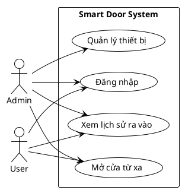
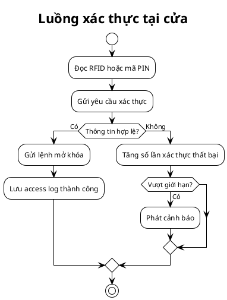
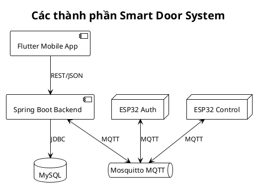
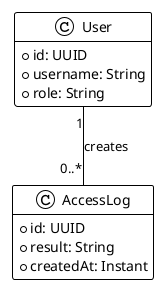
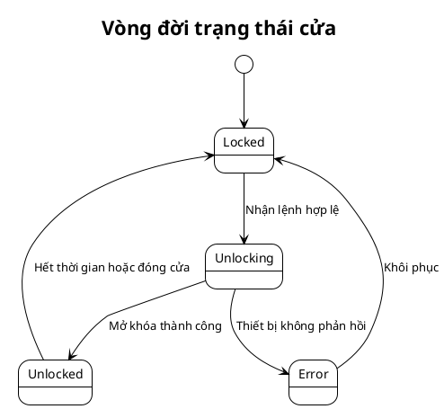

# Quy chuẩn sơ đồ PlantUML

Smart Door System sử dụng PlantUML làm định dạng chuẩn cho sơ đồ kỹ thuật. Source của sơ đồ phải được lưu dưới dạng `.puml`; khi cần hiển thị trực tiếp trên GitHub, xuất thêm file `.svg` và nhúng SVG vào Markdown.

## 1. Bộ sơ đồ khuyến nghị

Tùy phạm vi tài liệu, lựa chọn các sơ đồ phù hợp:

- **Use Case**: actor và các ca sử dụng chính.
- **Activity**: luồng nghiệp vụ, nhánh điều kiện và xử lý lỗi.
- **Sequence**: tương tác giữa Mobile, Backend, Database, MQTT và ESP32.
- **Component**: quan hệ giữa các thành phần của hệ thống.
- **Class hoặc ER**: entity, thuộc tính và quan hệ dữ liệu.
- **State**: vòng đời của thiết bị, cửa, cảnh báo hoặc bản ghi nghiệp vụ.
- **Deployment**: cách triển khai Backend, MySQL, Mosquitto và client.

Không bắt buộc một tài liệu phải chứa tất cả loại sơ đồ. Chỉ tạo sơ đồ giúp giải thích nội dung rõ hơn.

## 2. Vị trí lưu file

Sơ đồ thuộc tài liệu nào thì lưu gần tài liệu đó:

```text
<khu-vuc>/
├── <tai-lieu>.md
└── diagrams/
    ├── <ten-so-do>.puml
    └── <ten-so-do>.svg
```

Quy tắc:

- Tên file dùng `kebab-case`.
- File `.puml` là source chính và bắt buộc commit.
- File `.svg` được commit khi tài liệu Markdown cần render trực tiếp trên GitHub.
- Không chỉnh sửa SVG bằng tay; phải sinh lại từ source PlantUML.
- Khi thay đổi `.puml`, phải cập nhật SVG tương ứng trong cùng commit.

Nhúng sơ đồ vào Markdown:

```markdown

```

## 3. Cấu trúc source chuẩn

Mỗi file phải có `@startuml`, tiêu đề rõ nghĩa và `@enduml`:

```plantuml
@startuml
title <Tên sơ đồ>

' Nội dung sơ đồ

@enduml
```



Khuyến nghị chung:

- Dùng tiếng Việt hoặc tiếng Anh nhất quán trong cùng sơ đồ.
- Tên thành phần phải khớp với source code, API hoặc tài liệu hợp đồng.
- Không đưa mật khẩu, token, IP production hoặc thông tin bí mật vào sơ đồ.
- Sơ đồ phức tạp nên dùng `legend` hoặc `note` để giải thích ký hiệu.
- Hạn chế màu tùy chỉnh; ưu tiên theme và kiểu hiển thị thống nhất.

## 4. Cấu hình giao diện

Thêm cấu hình sau ở đầu sơ đồ khi phù hợp:

```plantuml
@startuml
!theme plain
skinparam shadowing false
skinparam backgroundColor white
skinparam defaultFontName Arial
skinparam ArrowColor #37474F
skinparam NoteBackgroundColor #FFF8E1
skinparam NoteBorderColor #F9A825

title <Tên sơ đồ>

@enduml
```



Nếu môi trường render không có font Arial, có thể bỏ `defaultFontName` để PlantUML dùng font mặc định.

## 5. Template Use Case



## 6. Template Activity



## 7. Template Sequence

```plantuml
@startuml
!theme plain
autonumber
title Luồng xác thực RFID qua MQTT

actor User
participant "ESP32 Auth" as AuthNode
queue Mosquitto
participant "Spring Boot" as Backend
database MySQL
participant "ESP32 Control" as ControlNode

User -> AuthNode: Quét thẻ RFID
AuthNode -> Mosquitto: Publish auth request
Mosquitto -> Backend: Deliver auth request
Backend -> MySQL: Kiểm tra quyền truy cập
MySQL --> Backend: Kết quả xác thực

alt Hợp lệ
  Backend -> Mosquitto: Publish unlock command
  Mosquitto -> ControlNode: Deliver unlock command
  ControlNode --> ControlNode: Mở khóa
else Không hợp lệ
  Backend -> Mosquitto: Publish denied event
endif
@enduml
```

## 8. Template Component



## 9. Template dữ liệu

PlantUML không có cú pháp ER chuyên biệt như một số công cụ khác, vì vậy sử dụng class diagram với stereotype `<<entity>>`:



## 10. Template State



## 11. Render và kiểm tra

PlantUML cần Java và Graphviz đối với một số loại sơ đồ. Sau khi cài PlantUML, kiểm tra source:

```powershell
plantuml -checkonly path\to\diagram.puml
```

Xuất SVG:

```powershell
plantuml -tsvg path\to\diagram.puml
```

Nếu sử dụng file JAR:

```powershell
java -jar plantuml.jar -checkonly path\to\diagram.puml
java -jar plantuml.jar -tsvg path\to\diagram.puml
```

Trước khi commit:

- [ ] PlantUML kiểm tra source thành công.
- [ ] SVG được sinh lại từ source mới nhất.
- [ ] Markdown hiển thị đúng đường dẫn SVG.
- [ ] Tên thành phần khớp với tài liệu và source code.
- [ ] Sơ đồ không chứa thông tin bí mật.

## 12. Tài liệu liên quan

- [Quy chuẩn quản lý tài liệu](00-docs-vault.md)
- [Bộ mẫu tài liệu](02-template-pack.md)
- [Chỉ mục tài liệu](../00-INDEX.md)
